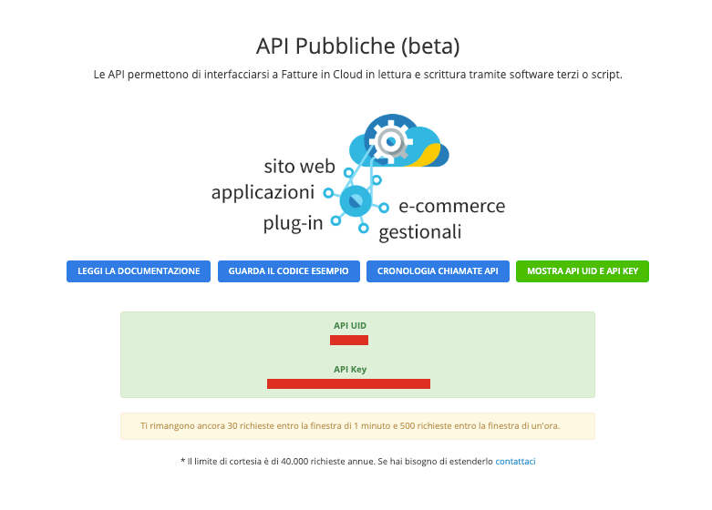

---
meta:
  - name: description
    content: This Laravel wrapper allows you to integrate a Laravel e-commerce platform with the invoicing program Fatture in Cloud using Api.
gitName: laravel-fatture-in-cloud
---

# laravel-fatture-in-cloud

This Laravel wrapper allows you to integrate a Laravel e-commerce platform with the invoicing program [Fatture in Cloud](https://fattureincloud.it) using Api.

## Installation and setup

### Basic installation

You can install this package via composer using:

``` bash 
composer require offline-agency/laravel-fatture-in-cloud
```
    
The package will automatically register its service provider.

To publish the config file to `config/backup.php` run:

``` bash 
php artisan vendor:publish --provider="OfflineAgency\FattureInCloud\FattureInCloudServiceProvider" --tag="config"    
```

### First configuration

This is the default contents of the configuration:

``` php
return [
    'api_uid' => env('FATTURE_CLOUD_API_UID'),
    'api_key' => env('FATTURE_CLOUD_API_KEY'),
    "endpoint" => "https://api.fattureincloud.it/v1/",
    "errors" => [
        "0" => [
            "code" => 400,
            "message" => "Errore generico."
        ],
        "1000" => [
            "code" => 401,
            "message" => "Autenticazione fallita. I parametri di utlizzo 'api_uid' e 'api_key' non sono validi."
        ],
        "1001" => [
            "code" => 400,
            "message" => "Uno dei parametri è mancante o non valido."
        ],
        "1004" => [
            "code" => 404,
            "message" => "L'azienda non esiste o è stata disabilitata."
        ],
        "1100" => [
            "code" => 400,
            "message" => "Il contenuto della richiesta non è corretto (probabilmente il json non è formattato correttamente)."
        ],
        "2000" => [
            "code" => 401,
            "message" => "La licenza è scaduta."
        ],
        "2002" => [
            "code" => 420,
            "message" => "Uno dei limiti di richieste (al minuto, orario o annuale) è stato superato."
        ],
        "2004" => [
            "code" => 403,
            "message" => "L'utilizzo delle API è stato bloccato per questo account."
        ],
        "2005" => [
            "code" => 403,
            "message" => "La licenza non consente l'utilizzo di questa funzione."
        ],
        "2006" => [
            "code" => 403,
            "message" => "L'accesso ai dati richiesti è ristretto."
        ],
        "4001" => [
            "code" => 420,
            "message" => "Non è possibile completare la richiesta perché è stato raggiunto il limite massimo di anagrafiche."
        ]
    ]
];
``` 

Add this key in your `.env` file.
        
    FATTURE_CLOUD_API_UID = API UID;
    FATTURE_CLOUD_API_KEY = API KEY;
 
Then replace `API UID` and `API KEY` with the values you find in the API section of your [Fatture in Cloud](https://fattureincloud.it) account (see image below).



## Questions & issues
Find yourself stuck using the package? Found a bug? Do you have general questions or suggestions for improving the plugin? Feel free to create an issue on [GitHub](https://github.com/offline-agency/laravel-fatture-in-cloud/issues), we’ll try to address it as soon as possible.

If you’ve found a bug regarding security please mail <support@offlineagency.com> instead of using the issue tracker.

## About Us

[Offline Agency](https://offlineagency.it) is a webdesign agency based in Padua, Italy.

Open source software is used in all projects we deliver. Laravel, Nginx, Ubuntu are just a few of the free pieces of software we use every single day. For this, we are very grateful. When we feel we have solved a problem in a way that can help other developers, we release our code as open source software on [GitHub](https://github.com/offline-agency).

This package was made by [Giacomo Fabbian](https://github.com/Giacomo92). There are [many other contributors](https://github.com/offline-agency/laravel-fatture-in-cloud/graphs/contributors) who devoted time and effort to make this package better.